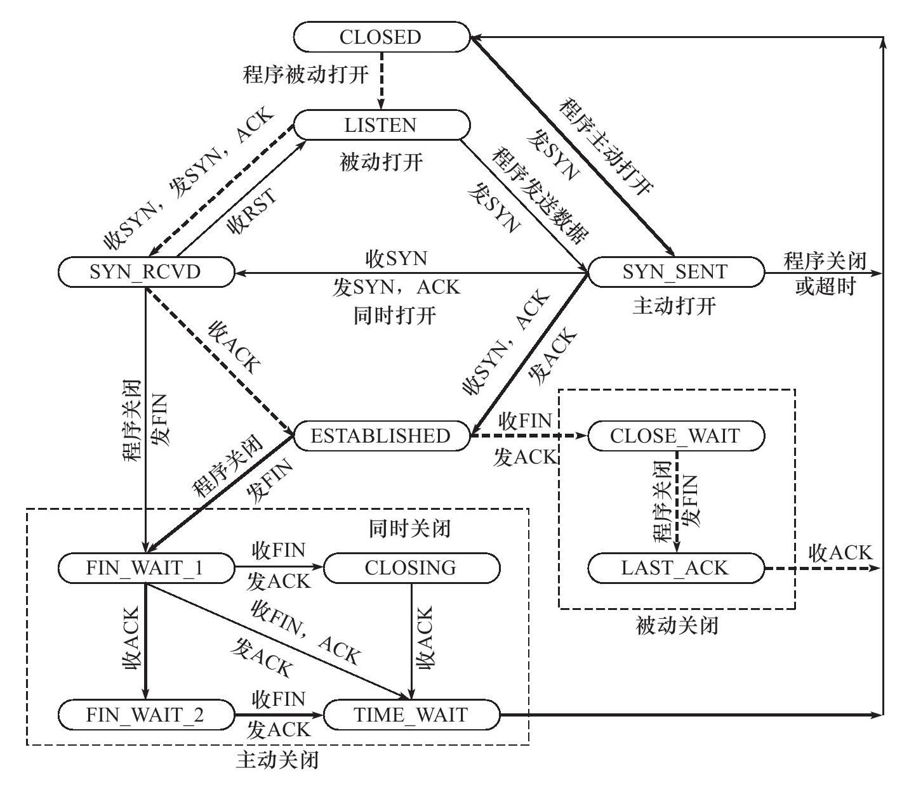

## TCP
- TCP头部
- TCP状态转移过程
- TCP数据流
- TCP数据流控制

### 特性：
- 面向连接: 全双工链接，通信建立在双方连接的基础上
- 字节流：
    - 发送端写操作———发送缓冲———》TCP模块——接收缓冲——》接收端读操作
    - 该过程中发送端的写操作的次数和发送的TCP报文个数无关，可能是多次发送，一次报文传输（缓冲区一次传递）
    - 概念：应用程序对数据的发送和接收是没有边界限制的，可以发多次，读一次；
    
- 可靠传输
    - 发送-应答机制：发送的每个报文都需要得到应答，才能确定成功
    - 超时重传机制：请求发送后，一段时间内没有收到应答，则重发
    - 基于IP数据报，故而会对接收到的报文重排+整理
    
### TCP头
- 结构：
    - 源端口号:0-65535
    - 目的端口号:0-65535
    - 序号: 以第一次报文段的序号（一个随机值）开始，每次递增；两端的序号是独立的
    - 确认号：对收到的TCP报文段序号+1（用于确认）
    - 标志位：用于标识报文含义
        - ACK: 确认报文
        - PSH: 提醒接收端立刻读数据，为后续数据腾出空间
        - RST: 复位
        - SYN: 请求建立连接（同步报文段）
        - FIN: 关闭连接（结束报文段）
    - 窗口大小：通知发送方，本地接收缓冲还能容纳的字节数
    - 头部长度
    - CRC校验码
    - 选项等

### 连接建立与关闭过程
- 连接建立：
    1. 客户端(C)发送SYN-1000
    2. 服务端(S)发送SYN-2000/ACK-1001() # 这里的SYN-2000就是服务端的序号，ACK-1001是对客户端的响应
    3. 客户端(C)发送ACK-2001
    
- 连接断开：
    1. 客户端发送FIN-1000
    2. 服务端发送ACK-1001
    3. 服务端发送ACK-1001/FIN-2000
    4. 客户端发送ACK-2001
    
- 半关闭状态：当一方发送关闭报文后，只有对方也确认关闭，才关闭；否则可以持续接受对方报文并发送响应报文，只是自己不主动发送了
- 超时重连：一方SYN失败一次，会重复发送5次，每段时间间隔增加一倍，直到5次重连都失败

- 状态转移图

- 状态转移过程
1. 被动打开
    - listen系统调用-》LISTEN状态（服务端开启监听端口/系统调用）
    - 收到SYN数据报，将连接置为SYN_RCVD, 放入内核等待队列中, 并同时发送SYN/ACK
    - 收到ACK数据报，进入ESTABLISH状态，进行双向传输
2. 主动连接
    - 