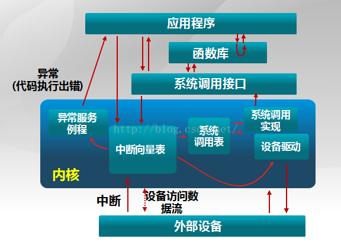

# 操作系统

## 概述

#### 基本概念与特征
- 并发/并行（分时/同时）
- 资源共享
    - 互斥访问
    - 同时访问（假的，实际上还是互斥，但是在一个时间段里允许多个访问，似乎在这个时间段里是同时）
    - 虚拟（时分复用，空分复用）
    - 异步（每个程序执行次序不固定）
   
- 同步/异步
    - 同步：调用者要一直等待返回消息（结果）通知后，才能进行后续的执行
    - 异步：调用者不能立刻得到返回消息（结果），而是被调用者后续通过状态/通知来告知

- 阻塞/非阻塞
    - 阻塞：阻塞调用是指调用结果返回之前，当前线程会被挂起，一直处于等待消息通知，
    - 非阻塞：发出请求后，请求端依然可以进行其他操作
    

#### 运行核心机制（系统态主要内容）

- 时钟管理

- 中断机制：硬件资源等外部到期了，扔个中断来通知下，可以继续使用

- 原语：原子性操作

- 系统控制的数据结构及处理
    - 进程管理：进程调度，状态管理，PCB管理
    - 存储器管理：存储器空间
    - 设备管理：缓冲区管理，设备分配等
     
#### 中断和异常和系统调用（用于系统态和用户态的切换）
- 中断：来自CPU外部的信息，例如I/O完成，或者时钟中断  
可以异步处理（扔到中断向量表里）

- 异常：CPU内部执行出现错误，必须同步处理

- 系统调用：用户态主动请求系统态的指令
    - 设备，文件，进程控制，进程通信，内存管理

- 总结：
    - 用户运行用户态程序，通过系统调用执行核心指令（主动）
    - 出现问题（异常），进入核心态处理；（被动）
    - 硬件周期到了，触发中断，核心态开始分配外部设备（主动）
    

