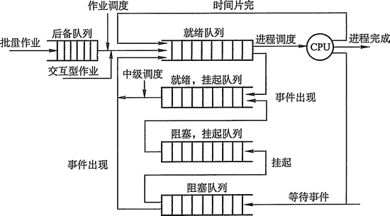
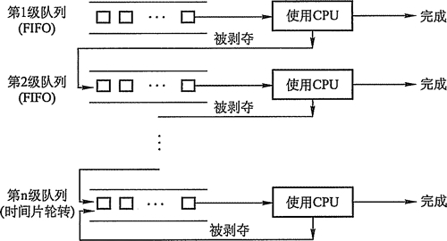

# 进程
程序的一次执行，由PCB（进程控制块）保存状态  
进程实体由程序段，数据段和PCB组成

## 进程的状态与转换
- 运行：R(在top里)

- 就绪（东西都好了，坐等调度）:R（这俩都是TASK_RUNNING)

- 阻塞（缺东西，比如I/O或者时钟等，即使调度也不能执行）:S

- 创建：正在被创建，PCB-》填写PCB-》分配资源

- 结束：释放资源，回收，etc

## 进程的控制

- 创建

A进程可以创建B进程，子进程可以继承父进程的资源，而当子进程GG的时候，需要归还资源给父进程；  
父进程被撤销，子进程同样要被撤销    
创建过程如下（创建原语）：  

    - 分配进程ID，申请空白PCB
    - 为进程分配资源（内存空间等），如果分配失败的话就会阻塞而不是失败（等待硬件资源【内存空间】）
    - 初始化PCB，设置优先级等
    - 插入到就绪队列中，等待被调度

- 终止

以下情况会导致结束：
  
    - 正常结束；  
    - 异常结束（本身出问题，抛出异常）；
    - 外界干预（外界请求，父进程请求）；
终止过程如下（撤销原语）  

    - 根据PID，检索PCB，读出状态
    - 若Running：终止执行，对其他Ready状态的进程进行处理调度
    - 若有子进程，递归终止子进程
    - 将其资源还给父进程或OS
    - 删除PCB

- 阻塞

资源没到位，主动阻塞，时间片交出的过程

阻塞原语执行过程：

    - 找到PID对应的PCB
    - 若Running，则保护现场，并更改状态
    - 将PCB加入到等待队列
    
唤醒原语执行过程：

    - 从等待队列中找到PCB
    - 移除队列并设置状态为Ready
    - 加入Ready队列中等待调度
    
    
- 切换（时间片轮转的时候从一个进程到另一个进程的调度）

    - 保存处理机上下文
    - 更新PCB信息（当前PCB，更新状态等）
    - 将PCB移入某个队列，如等待，阻塞
    - 选择另一个进程执行，并更新其PCB（状态）
    - 更新内存管理的数据结构
    - 恢复上下文（context）
    
## 进程的结构

#### PCB

| 描述信息  | 控制和管理信息  | 资源分配清单 | 处理机相关信息（调度信息）|
| :------------: | :------------: | :------------: | :------------: |
| PID | 进程状态     | 代码段指针   | 通用寄存器值 |
| UID | 进程优先级   |  数据段指针  | 地址寄存器   |
|     | 代码入口地址  | 堆栈段指针   | etc |
|     | 进入内容时间  | 文件描述符(fd)| 

- 描述信息：一些标志id，比如Process ID， User ID之类
- 控制与管理信息：状态，优先级之类在进程调度的时候用得着的东西
- 资源分配清单： 内存分配的位置，打开文件的列表等
- 处理机相关信息：处理机中各寄存器的值，在切换的时候，这里存有处理机的状态信息；  
被重新调度的时候可以从处理机的这些位置找回，继续执行

    需要注意的是，PCB经常以两种形式存放：
    
    链接方式：根据状态，将PCB们分割成队列；也可以根据同一个队列中PCB的一些特性分割成多个队列
    索引方式：根据状态把PCB放在不同的索引表里，@TODO：列举索引的key代表的因素
      

#### 程序段：  
程序代码片段，这部分可以被多进程共享（废话）

#### 数据段：  
可以是输入，也可能是中间数据，也可能是程序处理的结果，都放这里  

## 进程的通信

#### 共享存储
对进程间一块公共的空间进行读写操作，以实现信息交换  
操作时需要利用同步互斥（PV信号量等）进行读写控制  

#### 消息传递
没有共享空间时，利用操作系统提供的消息传递方法实现通信(类似于TCP的发送/接收)  
进程利用操作系统提供的send/receive两个原语来进行数据交换

    直接通信： 发送进程把消息直接扔接收进程的消息缓冲队列上，接收进程从这个队列上读消息
    间接通信： 有个中间实体（消息队列之类的），发送到这里，然后接收也从这边拿
   

#### 管道通信

特殊的消息传递方式（利用特殊的pipefs文件，只存在于内存）  
发送方以字符流的形式传递数据，而接收方从管道里接收数据(类似于Go中的channel?)  

- 无名管道  
用于父子进程或者兄弟进程（具有亲缘关系的），单向通信（互斥），仅存在于内存
- 命名管道  
存在于文件系统里，利用FIFO机制；可被多个进程读写；实际上数据还是存在于内存

    互斥：一个进程在一个管道里只能读/写，不能同时读写
    同步：读写需要同时进行，一个读另一个就要写，否则就会阻塞读/阻塞写
    两端确定：读写进程都需要存在

#### 线程

轻量级进程  
具有Ready，阻塞（sleeping）和Running三种状态  

    - 调度：用于被独立调度，同个进程内的线程切换不会导致进程切换
    - 不拥有资源：不独立拥有系统资源，只能依赖其进程
    - 可并发
    - 线程切换方便，系统开小小，不需独立分配资源（I/O，内存）
    - 线程通信可以通过直接读取进程数据段进行，不需要进程同步互斥等
    
存在用户级/系统级线程

#### 处理机调度

- 概念
从Ready队列中选出一个进程并执行
 
- 调度层次

    作业调度（高级）：从外存中挑选一个还没有分配资源的（阻塞的）进程，给他分配资源，并等待调度
    内存调度（中级）：已经Ready的进程，没调度时，扔到外存，改为挂起状态；从其中选一个调入内存，改为Ready，挂在Ready队列上
    进程调度（低级）：从Ready队列中挑选一个进程，并调度

- 三级调度的关系

    外存中的后备队列，选一些进程放到就绪队列，等待调度
    就绪队列中用不着的，就改到阻塞队列（挂起）里，等待有空的时候调度
    内存有空就从就绪队列里选一个，执行

- 进程调度方式：  

    非抢占：其他进程在运行时，不去中止，而是等它完成或者阻塞了，再去调度  
    特点：开销小，实现简单

    抢占：根据重要性和优先级，将处理机强行中止并分配给高优先级的进程
    特点：提高吞吐率和响应效率

- 调度的具体情况  

应当调度的情况：

    发生引起调度条件，且当前进程无法继续，需要马上切换（关键词：无法继续）
    中断处理结束，需要继续进行任务

不能调度的情况：

    处理中断的过程
    在内核的临界区里
    在原子性操作中

- 调度的原则

    CPU利用率
    吞吐量（单位时间完成作业的数量）
    周转时间（等待-结束的全时间）
    等待时间（整个过程在等待过程中的时间）
    响应时间（提交到响应）
    
    
## 经典调度算法
根据调度的类型，产生不同的调度算法

- FCFS(先来先服务)  
不可剥夺，算法简单，效率低

- SJF(短作业优先)  
平均等待时间短，对长时间作业不利

- 优先级调度  
根据进程优先级调度(剥夺/非剥夺)  

- 高响应比优先  

- 时间片轮转  
时间片分割，对每个进程执行一定时间；然后退出，原进程排到Ready队列末尾  
遵守FCFS  

- 多级反馈队列调度

    多个就绪队列，并有不同优先级，逐个下降
    每个队列中时间片不同，优先级越高，时间片越短（因为越重要）
    新进程默认在最高级队列末尾等待调度(FCFS), 不能在时间片完成的花就放到下一级队列末尾；在最后级依旧时间片轮转
    一级队列为空，则处理下一级；处理中，上一级（上层的任意一级）出现进程时，抢占并调度，当前进程扔到当前队列的末尾
    

