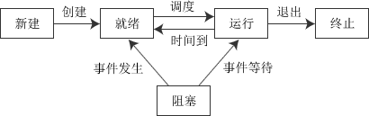

# 进程
程序的一次执行，由PCB（进程控制块）保存状态  
进程实体由程序段，数据段和PCB组成

## 进程的状态与转换
- 运行：R(在top里)

- 就绪（东西都好了，坐等调度）:R（这俩都是TASK_RUNNING)

- 阻塞（缺东西，比如I/O或者时钟等，即使调度也不能执行）:S

- 创建：正在被创建，PCB-》填写PCB-》分配资源

- 结束：释放资源，回收，etc

## 进程的控制

- 创建

A进程可以创建B进程，子进程可以继承父进程的资源，而当子进程GG的时候，需要归还资源给父进程；  
父进程被撤销，子进程同样要被撤销    
创建过程如下（创建原语）：  

    - 分配进程ID，申请空白PCB
    - 为进程分配资源（内存空间等），如果分配失败的话就会阻塞而不是失败（等待硬件资源【内存空间】）
    - 初始化PCB，设置优先级等
    - 插入到就绪队列中，等待被调度

- 终止

以下情况会导致结束：
  
    - 正常结束；  
    - 异常结束（本身出问题，抛出异常）；
    - 外界干预（外界请求，父进程请求）；
终止过程如下（撤销原语）  

    - 根据PID，检索PCB，读出状态
    - 若Running：终止执行，对其他Ready状态的进程进行处理调度
    - 若有子进程，递归终止子进程
    - 将其资源还给父进程或OS
    - 删除PCB

- 阻塞

资源没到位，主动阻塞，时间片交出的过程

阻塞原语执行过程：

    - 找到PID对应的PCB
    - 若Running，则保护现场，并更改状态
    - 将PCB加入到等待队列
    
唤醒原语执行过程：

    - 从等待队列中找到PCB
    - 移除队列并设置状态为Ready
    - 加入Ready队列中等待调度
    
    
- 切换